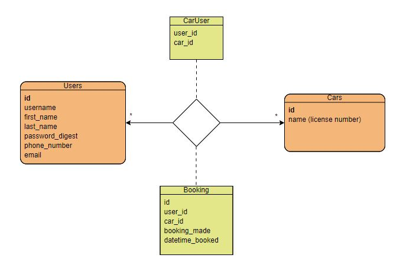
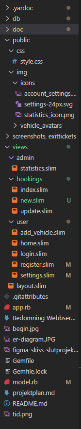

# Projektplan

## 1. Projektbeskrivning (Beskriv vad sidan ska kunna göra).
Jag ska göra en hemsida som är till för att boka bilen i familjen. Nu när jag och min syster fått körkrt använder alla tre pappas bil. Jag ska därför skapa ett system där man bokar/reserverar bilen en viss tid. Då krävs det inloggning, registering av bilar och sparande av bokningar. Och jag änkter att jag går efter principen mobile first.
## 2. Vyer (visa bildskisser på dina sidor).

## 3. Databas med ER-diagram (Bild på ER-diagram).

även attributet avatar under cars
## 4. Arkitektur (Beskriv filer och mappar - vad gör/innehåller de?).

Public-mappen finns css och img. 
Under css finns css-stylesheet.
i img finns mappen icons som innehåller ex inställningsknappen etc, och mappen vehicle_avatars som är avatarbilderna för bilarna
I views har vi flera mappar. Först på bild ser vi admin där det endast finns slim filen "statistics" som visar statistiken av användare och bokningar.
I mappen bookings hittar vi allt relaterat till bokningar. Index är sidan där vi kan få en översikt på bokningarna på bilen. "new.slim" ger sidan för att skapa en ny bokning. "update.slim" är sidan du ändrar en bokning på. 
I mappen user finns sidorna relaterat till användarna dvs login-sidan, registrerings-sidan, home dvs första sidan vid inloggning där man når inställmningar, bokningar etc, inställningar och möjligheten att koppla/Skapa en bil till sitt användarnamn och användarid. 
Sedan fins layout sidan som sätter gruden för alla slimsidorna (dvs språk, fonts etc)

I huvudmappen ligger också bilder som används på github, gem-filer, app.rb som är länken mellan slimfilerna och model.rb och är anvarig för routes, model.rb sköter funktioner och kommukation med databasen. 
