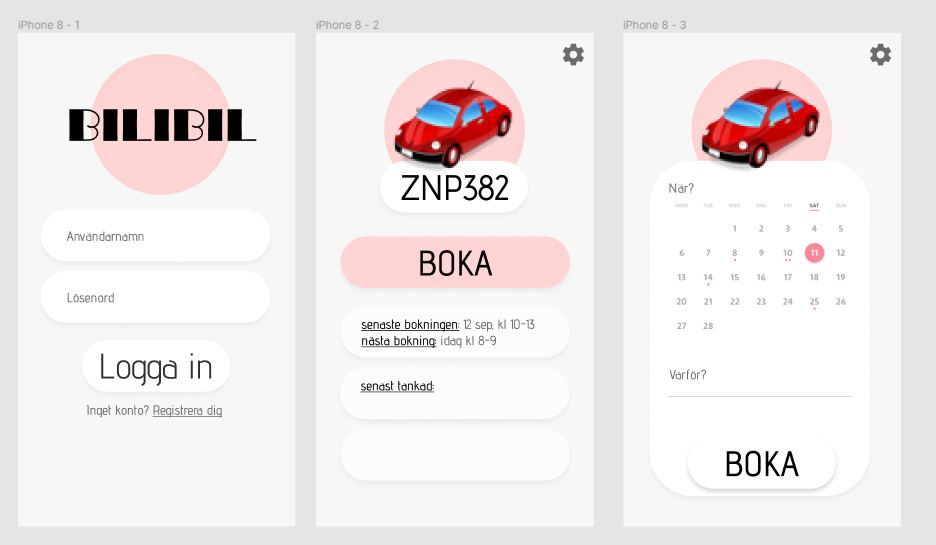

# Projektplan

## 1. Projektbeskrivning (Beskriv vad sidan ska kunna göra).
Jag ska göra en hemsida som är till för att boka bilen i familjen. Nu när jag och min syster fått körkrt använder alla tre pappas bil. Jag ska därför skapa ett system där man bokar/reserverar bilen en viss tid. Då krävs det inloggning, registering av bilar och sparande av bokningar. 
## 2. Vyer (visa bildskisser på dina sidor).

## 3. Databas med ER-diagram (Bild på ER-diagram).

## 4. Arkitektur (Beskriv filer och mappar - vad gör/innehåller de?).

